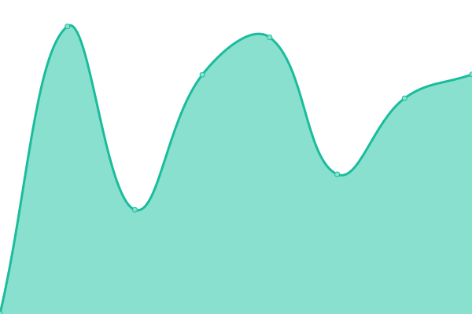

# [📈 Live Status](https://diagoriente.github.io/upptime): <!--live status--> **🟧 Partial outage**

This repository contains the open-source uptime monitor and status page for [Diagoriente](https://diagoriente.beta.gouv.fr), powered by [Upptime](https://github.com/upptime/upptime).

With [Upptime](https://upptime.js.org), you can get your own unlimited and free uptime monitor and status page, powered entirely by a GitHub repository. We use [Issues](https://github.com/diagoriente/upptime/issues) as incident reports, [Actions](https://github.com/diagoriente/upptime/actions) as uptime monitors, and [Pages](https://diagoriente.github.io/upptime) for the status page.

<!--start: status pages-->
<!-- This summary is generated by Upptime (https://github.com/upptime/upptime) -->
<!-- Do not edit this manually, your changes will be overwritten -->
<!-- prettier-ignore -->
| URL | Status | History | Response Time | Uptime |
| --- | ------ | ------- | ------------- | ------ |
|  [Site web](https://diagoriente.beta.gouv.fr) | En ligne | [site-web.yml](https://github.com/Diagoriente/upptime/commits/HEAD/history/site-web.yml) | 

 1229ms
     
 | 

<a href="https://diagoriente.github.io/upptime/history/site-web">100.00%</a>
    

|  [SSO Diagoriente](https://authentification.diagoriente.beta.gouv.fr) | En ligne | [sso-diagoriente.yml](https://github.com/Diagoriente/upptime/commits/HEAD/history/sso-diagoriente.yml) | 

 845ms
     
 | 

<a href="https://diagoriente.github.io/upptime/history/sso-diagoriente">100.00%</a>
    

|  [Plateforme](https://plateforme.diagoriente.beta.gouv.fr) | En ligne | [plateforme.yml](https://github.com/Diagoriente/upptime/commits/HEAD/history/plateforme.yml) | 

 933ms
     
 | 

<a href="https://diagoriente.github.io/upptime/history/plateforme">100.00%</a>
    

|  [Plateforme Pro](https://plateforme-pro.diagoriente.beta.gouv.fr) | En ligne | [plateforme-pro.yml](https://github.com/Diagoriente/upptime/commits/HEAD/history/plateforme-pro.yml) | 

 979ms
     
 | 

<a href="https://diagoriente.github.io/upptime/history/plateforme-pro">100.00%</a>
    

|  [Diagoriente CEJ](https://cej.diagoriente.beta.gouv.fr) | En ligne | [diagoriente-cej.yml](https://github.com/Diagoriente/upptime/commits/HEAD/history/diagoriente-cej.yml) | 

 1125ms
     
 | 

<a href="https://diagoriente.github.io/upptime/history/diagoriente-cej">100.00%</a>
    

|  [API SEMAFOR](https://semafor.diagoriente.beta.gouv.fr/docs) | En ligne | [api-semafor.yml](https://github.com/Diagoriente/upptime/commits/HEAD/history/api-semafor.yml) | 

 1759ms
     
 | 

<a href="https://diagoriente.github.io/upptime/history/api-semafor">100.00%</a>
    

|  [API SEMAFOR (recette)](https://semafor-recette.diagoriente.beta.gouv.fr/docs) | Hors ligne | [api-semafor-recette.yml](https://github.com/Diagoriente/upptime/commits/HEAD/history/api-semafor-recette.yml) | 

 1547ms
     
 | 

<a href="https://diagoriente.github.io/upptime/history/api-semafor-recette">100.00%</a>
    

<!--end: status pages-->

[**Visit our status website →**](https://diagoriente.github.io/upptime)

## 📄 License

- Powered by: [Upptime](https://github.com/upptime/upptime)
- Code: [MIT](./LICENSE) © [Anand Chowdhary](https://anandchowdhary.com), supported by [Pabio](https://pabio.com)
- Data in the `./history` directory: [Open Database License](https://opendatacommons.org/licenses/odbl/1-0/)
